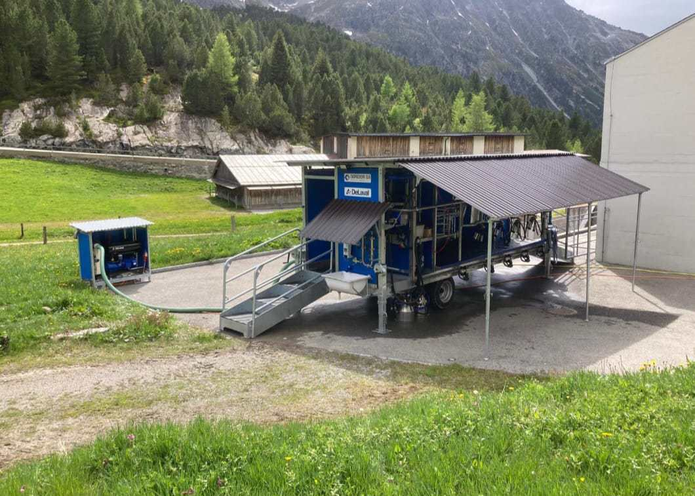

## Abstract

Bewegungsanalysen von Weidetieren können dazu genutzt werden, ein besseres Verständnis über Gruppendynamiken, deren räumlichen Bedarf und viele weitere verhaltensrelevante Aspekte zu gewinnen. Im Rahmen dieser Untersuchung wurde eine solche Bewegungsanalyse von Milchkühen auf einer Alpweide durchgeführt, wobei der Fokus auf der Identifizierung von Hierarchien, Subgruppen sowie Unterschieden zwischen Tieren derselben Rasse und rassespezifischen Unterschieden im Bewegungsverhalten lag. Für die Bewegungsanalyse, die mit RStudio durchgeführt wurde, wurden Daten aus dem bestehenden Projekt «PeaMaps» der Agroscope genutzt. Dabei kamen GPS‑Daten von Milchkühen dreier unterschiedlicher Rassen (Holstein, Original Braunvieh und Hinterwälder) zum Einsatz. Analysiert wurde das Bewegungsverhalten der Tiere auf dem Weg von der Weide bis zum Melkstand und zurück. Mithilfe der Zuordnung der Durchgangszahlen als Rang an fünf verschiedenen Messpunkten wurde anschliessend untersucht, ob es Leittiere gibt oder ob bestimmte Rassen tendenziell weiter vorne oder hinten laufen. Des Weiteren wurden eine Clusteranalyse und eine Distanzanalyse durchgeführt, um mögliche Subgruppen innerhalb der Herde zu identifizieren. Die Resultate zeigten, dass es sowohl rassespezifische als auch individuelle Unterschiede im Bewegungsverhalten gab.

## Einleitung

Studien zu sozialen Beziehungen bei Wildtieren haben gezeigt, dass viele Arten stabile soziale Bindungen und Hierarchien ausbilden und dass diese Beziehungen und Hierarchien teilweise massgeblich zur Erhöhung des individuellen oder gruppenbezogenen Fitnesserfolgs beitragen können [@stanton2012; @wittig2008; @silk2003].

Demgegenüber wurden soziale Strukturen in Nutztierherden, beispielsweise bei Milchkühen, bislang deutlich weniger untersucht, was vor allem dem produktionsbezogenen Forschungsfokus geschuldet ist. Entsprechend besteht bezüglich sozialen Dynamiken bei Nutztieren erhebliche Wissenslücken [@boyland2016].

Gleichwohl belegen zahlreiche Beobachtungen und Studien, dass Umgruppierungen oder Störungen sozialer Strukturen bei Milchkühen deutliche Nachteile mit sich bringen. Veränderungen in der Herdenzusammensetzung lösen messbare Stressreaktionen aus, die sich in veränderten Verhaltensparametern (z.B. reduzierte Liegezeiten, verändertes Fress- und Wiederkauverhalten) sowie in physiologischen Stressindikatoren wie erhöhten Cortisolwerten äussern [@raussi2005; @walker2015; @bøe2003]. Ebenfalls belegen Studien, dass auch die Milchleistung nach einer Umgruppierung häufig abnimmt [@vonkeyserlingk2008; @bøe2003].

Während zahlreiche Studien die Bedeutung der Herdendynamik anhand physiologischer und verhaltensbezogener Parameter beschreiben, gibt es bislang nur wenige Untersuchungen, welche soziale Strukturen innerhalb von Milchkuhherden anhand von Bewegungsdaten analysieren. Dabei bieten moderne hochauflösende GPS-Daten jedoch die Möglichkeit, soziale Beziehungen und Gruppenstrukturen objektiv zu erfassen, beispielsweise über räumliche Nähe- und Distanzmuster innerhalb der Herde.

Vor diesem Hintergrund untersucht die vorliegende Arbeit die Herdendynamik einer Milchkuhherde anhand von GPS-Daten. Dabei werden zwei zentrale Forschungsfragen adressiert:

-   Zeigt sich innerhalb der Gruppe eine Hierarchie? Gibt es ein Leittier, das meistens vorne läuft?

-   Lassen sich innerhalb der Herde anhand räumlicher Nähe- und Distanzmuster Subgruppen identifizieren?

## Daten und Methoden

### Daten

Zur Beantwortung der Forschungsfragen wurden Daten aus dem laufenden Agroscope-Projekt PeaMaps (2024-2027) verwendet, in dem verschiedene Milchkuhrassen auf der Alp Weissenstein mittels GPS getrackt werden. Ziel des Projekts ist der Vergleich des Bewegungsverhaltens unterschiedlicher Rassen unter alpinen Bedingungen, um Aussagen zur Eignung der jeweiligen Rassen für die Alpbeweidung zu ermöglichen. Dabei stehen sowohl Aspekte der Effizienz im Hinblick auf die Offenhaltung der Landschaft (z. B. Verbuschungskontrolle) als auch Fragen des Tierwohls im Fokus [@kurt2024].

Die vom Projektleiter Manuel Schneider zur Verfügung gestellten Rohdaten umfassen die in @tbl-Datenstruktur dargestellten Variablen.

+------------+-------------------------------------------------------------------------------------------------------+--------------------------------------------+
| Variable   | Beschreibung                                                                                          | Einheit                                    |
+============+=======================================================================================================+============================================+
| ID         | Eindeutige ganze Zahl zur Identifikation jeder Kuh; innerhalb jeder Rasse fortlaufend ab 1 nummeriert | ganze Zahl (Integer)                       |
+------------+-------------------------------------------------------------------------------------------------------+--------------------------------------------+
| Rasse      | Zugehörigkeit der Kuh zu einer Rasse                                                                  | HO = Holstein;                             |
|            |                                                                                                       |                                            |
|            |                                                                                                       | HW = Hinterwälder;                         |
|            |                                                                                                       |                                            |
|            |                                                                                                       | OB = Original Braunvieh                    |
+------------+-------------------------------------------------------------------------------------------------------+--------------------------------------------+
| Time       | Zeitpunkt der GPS-Messung                                                                             | YYYY-MM-DD HH:MM:SS                        |
+------------+-------------------------------------------------------------------------------------------------------+--------------------------------------------+
| Day        | Tag der Messung                                                                                       | 0-365 (Tagesindex)                         |
+------------+-------------------------------------------------------------------------------------------------------+--------------------------------------------+
| Hour       | Stunde der Messung                                                                                    | 0-23                                       |
+------------+-------------------------------------------------------------------------------------------------------+--------------------------------------------+
| TimeSlice  | kombinierte Informationen aus Datum und Zeitabschnitt der Messung                                     | MM-DD-A/M                                  |
|            |                                                                                                       |                                            |
|            |                                                                                                       | (M = Morgen, A = Abend)                    |
+------------+-------------------------------------------------------------------------------------------------------+--------------------------------------------+
| Altitude   | Höhe über Meer                                                                                        | Meter über Meer                            |
+------------+-------------------------------------------------------------------------------------------------------+--------------------------------------------+
| PDOP       | Genauigkeitsmass der GPS-Positionsbestimmung (Position Dilution of Precision)                         | numerischer Wert (Float)                   |
+------------+-------------------------------------------------------------------------------------------------------+--------------------------------------------+
| Valid      | Positionsqualität                                                                                     | kategorial (DGPS höchste Stufe)            |
+------------+-------------------------------------------------------------------------------------------------------+--------------------------------------------+
| NSat       | Anzahl empfangene Satelliten                                                                          | ganze Zahl (Integer)                       |
+------------+-------------------------------------------------------------------------------------------------------+--------------------------------------------+
| geom       | geometische Position                                                                                  | Punktgeometrie in LV95 (EPSG: 2056), Meter |
+------------+-------------------------------------------------------------------------------------------------------+--------------------------------------------+

: Datenstruktur der Rohdaten mit Übersicht der enthaltenen Variablen sowie deren Beschreibung und Einheiten {#tbl-Datenstruktur}

Insgesamt umfasst der Datensatz GPS-Positionsdaten von 44 Tieren (15 Holstein, 14 Hinterwälder, 15 Original Braunvieh) während ihrem Gang zwischen Weide und Melkstand (Hin- und Rückweg) (@fig-Rassen, @fig-Melkstand). Da täglich zwei Melkungen stattfanden, beinhaltet jeder Tag zwei Aufzeichnungsintervalle, die jeweils den Weg von der Weide zum Melkstand, den Melkvorgang sowie den Rückweg zur Weide abdecken. Ein Aufzeichnungsintervall, welches somit den gesamten Ablauf von der Weide zum Melkstand, die Melkung sowie den Rückweg zur Weide umfasst, dauert im Durchschnitt etwa vier Stunden. Das Messintervall betrug 20 Sekunden. Der Datensatz umfasst insgesamt 18 Tage und somit 36 Aufzeichnungsintervalle.

::: {#fig-Weissenstein layout-ncol="2"}
.png){#fig-Rassen height="300px"}

{#fig-Melkstand height="300px"}

Fotos von den verschiedenen Rassen und dem Melkstand auf der Alp Weissenstein [@strickhof.ch2025].
:::

Die im Datensatz enthaltenen 44 Tiere wurden dabei nicht alle zusammen von der Weide zum Melkstand und wieder zurück getrieben, sondern in kleineren Gruppen von 16-17 Tieren. Die Kombination der Tiere blieb dabei jeweils für eine Woche lang dieselbe. Folglich wurden in der Woche 1 (25.06.-30.06.2025), der Woche 2 (14.07-19.06.2025) und der Woche 3 (02.08.-07.08.2025) folgende Tiere zusammen zum Melkstand und wieder zurück getrieben @tbl-Subgruppen:

+--------------------------+-----------------------------------------------------------------------------------------------------------------------+
| Zeitperiode              | Subgruppen (gemeinsam zwischen Melkstand und Weide bewegte Tiere)                                                     |
+==========================+=======================================================================================================================+
| Wo. 1: 25.06.-30.06.2025 | HO 01, HO 02, HO 03, HO 04, HO 05, HW 08, HW 09, HW 10, HW 11, HW 12, HW 13, HW 14, OB 01, OB 03, OB 04, OB 05, OB 06 |
+--------------------------+-----------------------------------------------------------------------------------------------------------------------+
| Wo. 2: 14.07.-19.07.2025 | HO 06, HO 07, HO 08, HO 09, HO 10, HW 01, HW 02, HW 03, HW 04, HW 09, HW 10, HW 11, OB 07, OB 09, OB 10, OB 11        |
+--------------------------+-----------------------------------------------------------------------------------------------------------------------+
| Wo. 3: 02.08.-07.08.2025 | HO 11, HO 12, HO 13, HO 14, HO 15, HW 05, HW 06, HW 07, HW 08, HW 13, HW 14, OB 02, OB 08, OB 12, OB 13, OB 14, OB 15 |
+--------------------------+-----------------------------------------------------------------------------------------------------------------------+

: Zusammensetzung der Subgruppen während der drei Untersuchungsperioden. Aufgeführt sind die Tiere, die innerhalb derselben Zeitperiode gemeinsam den Weg von der Weide zum Melkstand sowie zurück zur Weide zurücklegten. Die Tierkennungen setzen sich aus der Rasse (HO = Holstein, HW = Hinterwälder, OB = Original Braunvieh) und einer individuellen ID zusammen. {#tbl-Subgruppen}

### Datenvorverarbeitung

Die Analyse wurde in RStudio mit R (Version 4.5.2, @R) durchgeführt. Das Paket sf von @sf wurde für das Einlesen und die räumliche Verarbeitung der GeoPackage-Dateien verwendet. Für die Daten Vorbereitung (pre procesing) wurden die Pakages des tidyverse genutzt, tidyr und dplyr für die Datentransformation, lubridate für Datum und Zietangaben [@tidyverse]. Visualisierungen wurden mit tmap von @tmap oder ggplot2 von @ggplot2 erstellt. Für die Optimierung des R-Codes sowie für die Recherche wurde das KI-Sprachmodell Claude Sonnet 4.6 eingesetzt [@Anthropic2025]. Auf Grund der grossen Datenmenge wurde beschlossen, die Daten in einem separaten [Skript](https://rpubs.com/amachjon/1444291) zu verarbeiten  und die fertigen Grafiken anschliessend in diesen Bericht einzufügen. 

Um den Rahmen dieser Semesterarbeit einzuhalten, beschränkt sich die Analyse auf die untersuchung der Daten der dritten Erhebungswoche (@tbl-Subgruppen). Rohsdaten aus GPS-Aufzeichnungen enthalten systematische Messungenauigkeiten, die auf atmosphärische Störungen, Abschattung oder Reflexion durch Gelände und Vegetation zurückzuführen sind [@FrairEtal2010; @LaubePurves2011]. Zur Positionsbestimmung benötigt ein GPS-Empfänger das Signal von mindestens vier Satelliten [@HofmannWellenhofEtal2008]. Da die Rohdaten offensichtliche Ungenauigkeiten aufwiesen, wurden alle Fixes mit ungenügender Satellitenabdeckung entfernt. Anschliessend wuden für Milchkühe unrelistisch hohe geschwindikeiten aussortiert. Dazu wuden die folgenden Konvinience variabeln berechnet, das Segment, Strecke zum nächsten Fix und die Zeit welche gebraucht wurde um diese Strecke zurück zu legen (timelag), daraus ergibt sich die Schritgeschwindikeit. Fixes am Anfang und Ende eines Segments mit Schrittgeschwindigkeit von mehr als 25 Kmh wurden entfernt. Zuletzt wurden die Trajektorien zeitlich auf die Wegphasen beschränkt, dazu wurde für den Hin- und Rückweg jeweils den Zeitraum zwischen der ersten übercshreitung der Startline und der letzten überschreitung der Zielline ermittelt (@fig-Wege_Messlinen). Ein 2 min. Buffer dient dazu sicher zustellen, dass auch das Segment der Start und Ziellinienüberschreitung sicher noch im Datensatz enthalten ist.

### Methoden

Um die Sozialstrukturen der Tiere besser zu verstehen, wurden verschiedene Analysen zur Identifikation möglicher Subgruppen innerhalb der Versuchsgruppe durchgeführt. Einerseits wurde die Passierreihenfolge und der zeitliche Rückstand auf das erste Tier beim Überqueren von fünf über den Weg verteilten Messlinien berechnet, um die Rangordnung der Gruppe analysieren zu können. Zum anderen wurden mittels Clusteranalyse und euklidischer Distanz von Tier zu Tier Subgruppen in der Herde identifiziert.

::: {#fig-Wege_Messlinen}

<iframe
  src="Grafik_1.html"
  width="100%"
  height="600px"
  style="border:none;">
</iframe>

Darstellung der beiden genutzten Wege und den definerten Start-, Ziel- und Messlinen. Wanderweg nördlich in schwarz, Strasse südlich in balu, Startlinie bei der 
Weide in grün, Messlinen in dunkelgrün und Zielline beim Melkstand in rot.
:::

Die Tiere nutzten für die Wege zwischen Weide und Melkstand sowie für den Rückweg zur Weide stets dieselben zwei Routen. Nördlich über den Wanderweg oder südlich über die Passstrasse (@fig-Wege_Messlinen). In allen Zeitperioden (@tbl-Subgruppen) wurden beide Routen von den Tieren genutzt, zu einem gegebenen Zeitpunkt haben jedoch alle Kühe die selbe Rute benutzt. Die beiden Routen wiesen dabei ähnliche Längen auf, wobei die insgesamt zurückgelegte Strecke für Hin- und Rückweg etwa zwei Kilometer beträgt (@fig-Hin_Rückweg). Die beiden Routentrajektorien wurden auf Grundlage der Aufzeichnungen der Kuh HO01 konstruiert. Punkte, an welchen die Kuh sich nicht oder kaum bewegt hat, wurden durch Entfernung von Segmenten mit einer Länge unter 5 m herausgefiltert, da quasi-statische Trajektorienabschnitte die abgeleiteten Bewegungsparameter verzerren [@LaubePurves2011, S. 407]. Zusätzlich wurden die Routentrajektorien mit einem gleitenden Mittelwert über drei aufeinanderfolgende Punkte geglättet. Die Start- und Ziellinie wurden nach Betrachtung der örtlichen Gegebenheiten festgelegt, die fünf Messlinien pro Route wurden so berechnet, dass sie den Weg in sechs gleich lange Teile teilen (@fig-Wege_Messlinen). Die Linien wurden als Senkrechte auf dem Wegeverlauf konstruiert. Dazu wurde an den entsprechenden Messpunkt der lokale Richtungsvektor über ein Fenster von fünf Punkten approximiert und anschliessend durch Rotation um 90° eine orthogonale Line erzeugt. Die Routenzuordnung der einzelnen Melkgänge erfolgte anhand der minimalen mittleren Distanz der GPS-Punkte zu den jeweiligen Routentrajektorien (@fig-Hin_Rückweg).

::: {#fig-Hin_Rückweg}

<iframe
  src="Grafik_2.html"
  width="100%"
  height="600px"
  style="border:none;">
</iframe>

Abbildung aller GPS Trajektorien und der zugeteilten Route. Grün: Punkte von Kühen, die auf dem Wanderweg unterwegs waren. Blau: Punke, die dem Weg über die Passstraße zugeordnet werden.
:::

Der Zeitpunkt der Messlinienüberschreitung wurde mittels geometrischer Verschneidung (st_intersects) zwischen den Segmenten und den Messlinien ermittelt. Zur Präzisierung des Überquerungszeitpunkts wurde der Anteil des Jeweiligen Segments, welcher bis zur Schnittpunktposition zurückzulegen war, berechnet und proportional auf die Zeitspanne zum nachfolgenen GPS-Fixes übertragen. Bei mehrfachen Überschreitungen derselben Messlinie innerhalb eines Melkgangs wurde nur die erste Überquerung berücksichtigt. Anschliessend wurde die Rangfolge inerhalb der Versuchsgruppe und den Rückstand auf das vorderste Tier berechnet. Der durshschnittliche Rückstand auf das Erste Tier wurde mitels Rankplot visualisiert. Paarweise Unterschide zwischen zwischen den Tieren hinsichtlich dem Rang in der Grupp wurde mittels Dunn-Test (BH-Korrektur) identifiziert [@agricolae]. Um festzustellen, welche Tiere häufig gemeinsam unterwegs sind, wurde beim Erreichen einer Messlinie durch die erste Kuh jeweils eine Momentaufnahme aller Tierpositionen erstellt. Diese Positionen wurden anschliessend mittels K-Means-Clusteranalyse analysiert, wobei die optimale Clusteranzahl über das Calinski-Harabasz-Kriterium bestimmt wurde [@vegan], die minmale Klusteranzahl bertug 2 die maximale 6. Zusätzlich wurden die Positionen der Tiere anhand der euklidischen Distanz analysiert. Als Schwellenwert für „zusammen unterwegs sein” wurde hierbei ein Abstand von 5 m gewählt. Die Ergebnisse der Subgruppenanalyse wurden in einer Co-Occurrence-Matrix zusammengefasst und anschliessend als gewichtetes Netzwerk mit dem Paket igraph [@igraph] visualisiert. Zum schluss wurde mittels Mantel-Test wurde geprüft, ob Kühe der gleichen Rasse häufiger räumliche Nähe zueinander aufweisen als rassenübergreifende Paare [@Mantel1967; @vegan].

## Resultate

Die Analysen zeigen, dass die Hinterwäldler-Kühe oft an der Spitze der untersuchten Gruppe zu finden sind. HW06 und HW13 sind signifikant häufiger an der Spitze der Gruppe anzutreffen als andere Kühe (siehe @fig-Rang). Es ist festzustellen, dass der Rückstand der Kühe auf die Schnellsten während des starken Anstiegs auf dem Wanderweg zunimmt (@fig-WW_Hin). Ebenso zeigt sich, dass die Gruppe kurz vor und nach dem Melkstand näher beieinander ist als in der Nähe der Weide (@fig-Str_Rückweg).

::: {#fig-WW_Hin}

Die Entwicklung des Rückstands in Sekunden auf die erste Kuh wurde pro Messlinie über alle Wege zum Melkstand, die über die Wanderwegroute führten, gemittelt. Die Hinterwäldler-Kühe sind in Grüntönen, die Original Braunen in Blau und die Holsteins in Rot dargestellt. Unten ist das Höhenprofil des Wanderwegs zu sehen.
:::

::: {#fig-Str_Rückweg}

Die Entwicklung des Rückstands in Sekunden auf die erste Kuh wurde pro Messlinie über alle Wege zurück zur Weide, die über die Passstrase führten, gemittelt. Die Hinterwäldler-Kühe sind in Grüntönen, die Original Braunen in Blau und die Holsteins in Rot dargestellt. Unten ist das Höhenprofil des Passstrase zu sehen.
:::

::: {#fig-Rang}

Die Tiere unterscheiden sich hinsichtlich ihres durchschnittlichen Ranges in der Gruppe höchst signifikant (Kruskal-Wallis-Test, H = 866,8, df = 15, p \< 0,001) und der Effekt ist groß (ε² = 0,35). Die Buchstaben zeigen die Gruppen an, die sich signifikant unterscheiden.
:::

Die Netzwerke aus der Clusteranalyse (@fig-Klust) und der 5m‑Distanzanalyse (@fig-Dist5) zeigen, dass bestimmte Tiere sich deutlich häufiger in räumlicher Nähe zu bestimmten anderen Tieren befinden. Sichtbar ist, dass Tiere innerhalb derselben Rasse häufiger näher zusammenlaufen als Tiere unterschiedlicher Rassen (@fig-Mantel). Zudem lässt sich erkennen, dass die Hinterwälder‑Tiere insgesamt in grösseren Distanzen zueinander laufen als Tiere der anderen Rassen, was in der 5m‑Distanzgrafik durch die dünneren Verbindungslinien sichtbar wird.

::: {#fig-Klust}

Die Clusteranalyse zeigt, welche Tiere in derselben Subgruppe unterwegs sind. Je näher sich zwei Tiere in diesem Diagramm sind und je stärker die Verbindungslinie ausgeprägt ist, desto wahrscheinlicher ist es, dass die Kühe in der gleichen Subgruppe beobachtet werden können.
:::

::: {#fig-Dist5}

Die Analise der Distanzen zwischen den Teren zeigt auf welche Tiere oft nahe (\< 5m) bei einander anzutreffen sind. Je näher sich zwei Tiere in diesem Graphen sind und je stärker die Verbindungslinie ausgeprägt ist, desto öfter sind sie nahe beieinander an zu trefen.
:::

::: {#fig-Mantel}

Tiere derselben Rasse befinden sich signifikant häufiger gemeinsam innerhalb einer 5m‑Distanz als Tiere unterschiedlicher Rassen (Mantel-Test, r = 0.478, p = 0.001, 999 Permutationen) was als Co‑Occurrence bezeichnet wird.
:::

## Diskussion

Diskussion fertig: Die Ergebnisse bestätigen die von uns aufgestellten Hypothesen und zeigen, dass innerhalb der zum Melkstand bzw. zur Weide getriebenen Gruppe sowohl Hierarchien als auch Subgruppenbildungen bestehen. Dabei konnten wir feststellen, dass es sowohl rassen- als auch tierspezifische Unterschiede in der Positionierung der Tiere innerhalb der getriebenen Gruppe gab. Auffällig war insbesondere, dass sich die Hinterwälder‑Kühe häufiger in den vorderen Rängen aufhielten, während sich die Originalbraunvieh‑ und Holstein‑Kühe beim Gang zum Melkstand oder zur Weide eher im hinteren Bereich befanden. Zudem zeigte sich, dass die vordersten als auch die hintersten Tiere weitgehend aus denselben Individuen bestanden. Während beispielsweise die Hinterwälder‑Kuh mit der ID 6 konsistent zu den vordersten Tieren gehörte, befand sich die Holstein‑Kuh mit der ID 12 durchgehend in den hintersten Rängen. Tiere, die sich hingegen im mittleren Bereich der getriebenen Herde aufhielten, zeigten eine generell grössere Varianz in ihrer Positionierung als jene in den vordersten oder hintersten Bereichen. Ebenfalls ist in den Grafiken erkennbar, dass es innerhalb derselben Rasse Tiere gab, die tendenziell deutlich vor oder hinter dem rassetypischen Durchschnittsbereich liefen. So lief beispielsweise die Holstein‑Kuh mit der ID 13 tendenziell eher im vorderen Bereich mit und war damit innerhalb der Holstein‑Gruppe häufig eines der führenden Tiere. Diese von uns identifizierten rassetypischen Unterschiede in der Anordnung innerhalb der Gruppe könnten durch verschiedene Gründe erklärt werden. Ein möglicher Grund dafür, dass sich die Hinterwälder-Tiere häufiger im vorderen Bereich der Gesamtgruppe aufhielten, könnte in ihrer ausgeprägteren Berggängigkeit liegen, welche bereits im Rahmen des PeaMaps-Projekts bestätigt wurde. Allerdings wäre unter dieser Annahme zu erwarten gewesen, dass die Führungsstärke der Hinterwälder‑Tiere gegenüber den anderen Rassen auf flacheren Wegabschnitten oder auf der Strasse geringer ausfällt, was sich anhand der je zwei Grafiken zu den Rangordnungen auf fünf Wegabschnitten sowohl auf der Strasse als auch auf dem Wanderweg nicht bestätigen lässt. Um den Einfluss der unterschiedlichen Berggängigkeiten der Rassen auf die Rangordnung fundiert prüfen zu können, wäre eine Untersuchung erforderlich, in der der Faktor Wegbeschaffenheit (Untergrund, Steigung, technische Schwierigkeit) klar vom rassespezifischen Bewegungsverhalten getrennt erfasst und analysiert wird. Des Weiteren konnten wir auch Subgruppenbildungen sowie «Laufpartnerschaften» identifizieren. Anhand der Netzwerkanalyse lässt sich erkennen, dass sich insbesondere Tiere derselben Rasse tendenziell in denselben Subgruppen aufhielten bzw. bevorzugt in räumlicher Nähe zueinander liefen. Zudem zeigt die Netzwerkanalyse, dass die Hinterwälder‑Kühe insgesamt weniger häufig in sehr geringer Distanz zueinander liefen als die Originalbraunvieh‑ oder insbesondere die Holstein‑Tiere. Ob diese Subgruppenbildungen bzw. «Laufpartnerschaften» sozialer Natur sind oder eher auf physiologische Eigenschaften der Tiere der unterschiedlichen Rassen zurückzuführen sind, lässt sich anhand unserer Analyse jedoch nicht eindeutig bestimmen. Die vermehrt beobachtete räumliche Nähe zwischen Holstein‑ und Originalbraunvieh‑Tieren könnte durch eine durch treibdruck induzierte Gruppendynamik erklärt werden. Dabei sammeln sich langsamere oder weniger motivierte Tiere am Ende der Herde an und werden durch den von hinten wirkenden Treibdruck in dichterer Formation nach vorne geschoben. Dieses mechanisch bedingte Muster kann scheinbare Laufpartnerschaften erzeugen, die nicht sozial begründet sind. Um tatsächliche soziale Beziehungen zwischen einzelnen Tieren untersuchen zu können, wäre folglich ein Untersuchungsdesign ohne menschlichen Einfluss, beispielsweise Beobachtungen auf freier Weide ohne Treiben, besser geeignet. Auf soziale Beziehungen beziehungsweise auf eine typische Charakteristik von Herdentieren könnte zudem hinweisen, dass in den Grafiken teilweise die zeitliche Distanz zwischen einzelnen Tieren und dem jeweiligen Leittier deutlich zunimmt. Dies könnte darauf zurückzuführen sein, dass einzelne Tiere kurzfristig stehen bleiben, beispielsweise um zu grasen, und andere Tiere dieses Verhalten nachmachen, was auf gruppendynamische Effekte hindeutet. Abschliessend lässt sich sagen, dass sich anhand dieser Bewegungsanalyse sowohl Hierarchien als auch gruppendynamische Aspekte klar identifizieren liessen. Die Aussagekraft dieser Befunde ist jedoch aufgrund der geringen Wiederholbarkeit begrenzt. Die Analyse weiterer Tage (Wiederholungen), an denen die Tiere zum Melkstand oder zur Weide liefen würde dazu beitragen, die gewonnenen Erkenntnisse zu verifizieren oder gegebenenfalls zu widerlegen. Als weitere Analyse innerhalb unseres Projekts wären Berechnungen zur Zeitdauer bzw. zu den mittleren Geschwindigkeiten pro Tier auf den unterschiedlichen Wegtypen, (Wanderweg vs. Strasse) interessant gewesen. Damit liesse sich, wie bereits erwähnt, der Einfluss der rassespezifischen Berggängigkeit auf das Bewegungsverhalten genauer quantifizieren.

## Anhang

